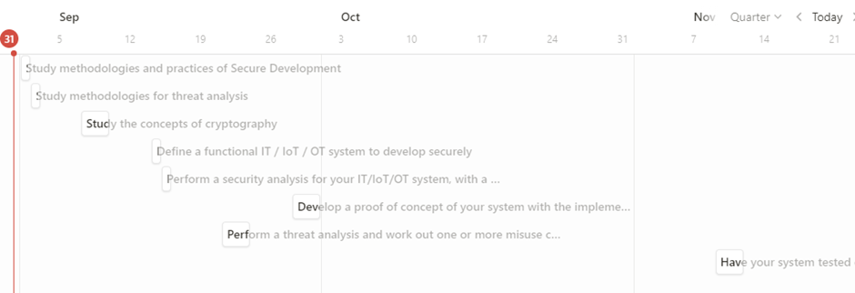

# **Learning Activities and Products**

There are many activities and tasks that have to be done in order to
become a security engineer. The following activities and tasks are
needed:

**Learning tasks (Body of Knowledge)**

1.  (1 day, N) - **MUST HAVE** - Study methodologies and practices of
    Secure Development (Secure Development Lifecycle, Security by
    Design, Privacy by Design. Give an overview of these standards and
    how and where they are applied in your portfolio or in an blog or
    article.

2.  (1 day, N) - **MUST HAVE** - Study methodologies for threat
    analysis: Threat actors, Risk Analysis, STRIDE, Attack Trees. Give
    an overview of these standards and how they can be applied in your
    portfolio or in an blog or article.

3.  (2-3 days, T) - **MUST HAVE** -Study the concepts of cryptography
    and how it can be applied in practice in data storage and
    communication, and what cryptographic vulnerabilities can be present
    in applications and systems. Give an overview in your portfolio or
    in an blog or article. Use e.g. the crypto 101 module on tryhackme
    to learn.

**Research and development tasks** 

There are no have to have activities for this field so I will be going
to choose my own activities.

1.  (1-2 days, T) Implement a new way of two-factor authentication, e.g.
    a password combined with NFC, or with face recognition, SMS etc.

2.  (1-2 days, T) Fix some security bugs in an application or system
    environment. (For example the results from the first Red Team vs.
    Blue Team event). Report on the bugs and your fixes in your
    portfolio. 

3.  (1 days, T)  Implement data encryption on application code level.
    Select a trusted cryptographic library for your programming
    language, find/select a use case for data encryption and implement
    the data encryption with the use of AES and the best fit block
    chaining method. Be aware of the difficulty of secure key handling
    (you don\'t want to hard code keys in your code) and find a good way
    to solve this problem. Explain your approach and the essential
    coding snippets and an example of execution of the code in your
    portfolio.

**Professional application tasks** 

1.  (1 day, PN) - **MUST HAVE** - Define a functional IT / IoT / OT
    system to develop securely (define functionality, user groups and
    use cases, system and network architecture):\
    - with internet access or internet connections,\
    - with multiple components (e.g. front end, back end, database
    server, IoT components, OT components)\
    - with an application layer, and a system and network environment. 

2.  (1 day, PN) - **MUST HAVE** - Perform a security analysis for your
    IT/IoT/OT system, with a Privacy Impact Analysis, CIA requirements, 

3.  (2-3 day, PN) - **MUST HAVE** - Perform a threat analysis and work
    out one or more misuse cases (a.k.a. abuse cases) for the threats of
    your IT/IoT/OT system. Research and add the best security counter
    measures in all components and on application, system ánd network
    level to your security design to detect and prevent the misuse
    cases.

4.  (8-10 days, RT) - **MUST HAVE** - Develop a proof of concept of your
    system with the implementation of the security that you have
    designed in your misuse cases.

5.  (1 day (2 times?), PN) - **MUST HAVE** - Have your system tested on
    security on the Red Team - Blue Team test event. Give an overview of
    the results and needed improvements in your portfolio.

I will use Notion to manage my tasks and activity. I already made a
small plan in order to show the tasks and activities that I will going
to work on in the next weeks. The following screen shot is the first
version of my plan:

