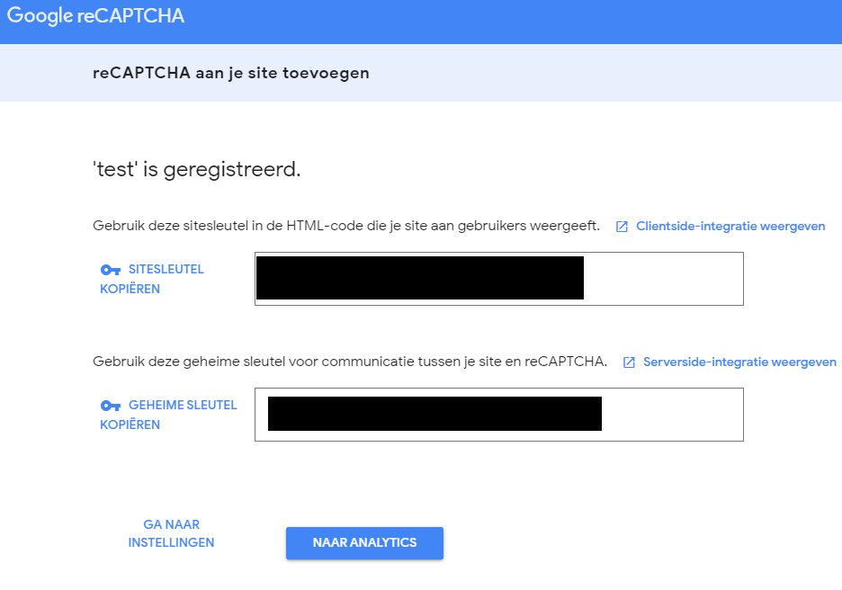
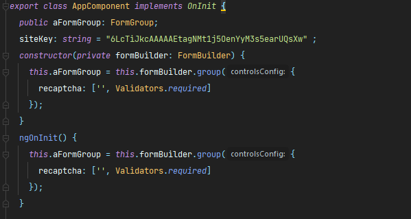
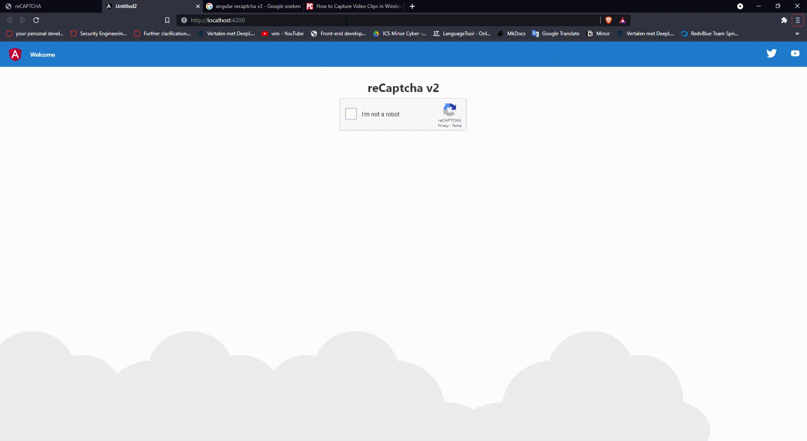

#  CAPTCHA-mechanism

## What is CAPTCHA

CAPTCHA stands for the Completely Automated Public Turing test to tell
Computers and Humans Apart. CAPTCHAs are tools you can use to
differentiate between real users and automated users, such as bots.
CAPTCHAs provide challenges that are difficult for computers to perform
but relatively easy for humans. For example, identifying stretched
letters or numbers, or clicking in a specific area.[[1]](#1)

## What are CAPTCHAs Used for?

CAPTCHAs are used by any website that wishes to restrict usage by bots.
Specific uses include:

**Maintaining poll accuracy**

CAPTCHAs can prevent poll skewing by ensuring that each vote is entered
by a human. Although this does not limit the overall number of votes
that can be made, it makes the time required for each vote longer,
discouraging multiple votes. [[1]](#1)

**Limiting registration for services**

services can use CAPTCHAs to prevent bots from spamming registration
systems to create fake accounts. Restricting account creation prevents
waste of a service's resources and reduces opportunities for fraud.
[[1]](#1)

**Preventing ticket inflation**

ticketing systems can use CAPTCHA to limit scalpers from purchasing
large numbers of tickets for resale. It can also be used to prevent
false registrations to free events. [[1]](#1)

**Preventing false comments**

CAPTCHAs can prevent bots from spamming message boards, contact forms,
or review sites. The extra step required by a CAPTCHA can also play a
role in reducing online harassment through inconvenience. [[1]](#1)

## reCaptcha v2 in practice

I use Angular js and ngx/captcha library to make my own reCAPTCHA.
Before that I generate a site secret key with Google API.

After that I add the captcha as a from to my component with a required
validator.

After that I add the html code of the reCAPTCHA and the form of the
reCAPTCHA.

I took a video capture of the results and convert it to GIF. The
following Gif is the results and it´s works fine .

# References

[1] Kerman, D., Ray, T., McKeever, G., Simmons, E., Hewitt, N., Hasson, E., McKeever, G., P.W., & Hewitt, N. (2021). What Does CAPTCHA Mean? | CAPTCHA Types & Examples | Imperva. Learning Center.   [	https://www.imperva.com/learn/application-security/what-is-captcha/#:%7E:text=CAPTCHA%20stands%20for%20the%20Completely,but%20relatively%20easy%20for%20humans.](	https://www.imperva.com/learn/application-security/what-is-captcha/#:%7E:text=CAPTCHA%20stands%20for%20the%20Completely,but%20relatively%20easy%20for%20humans.)
