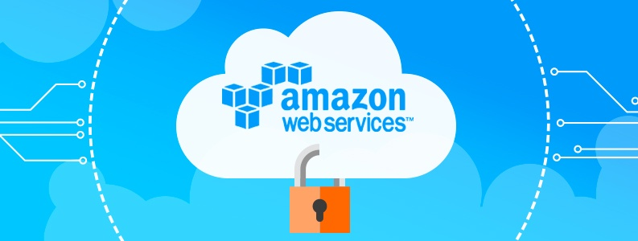
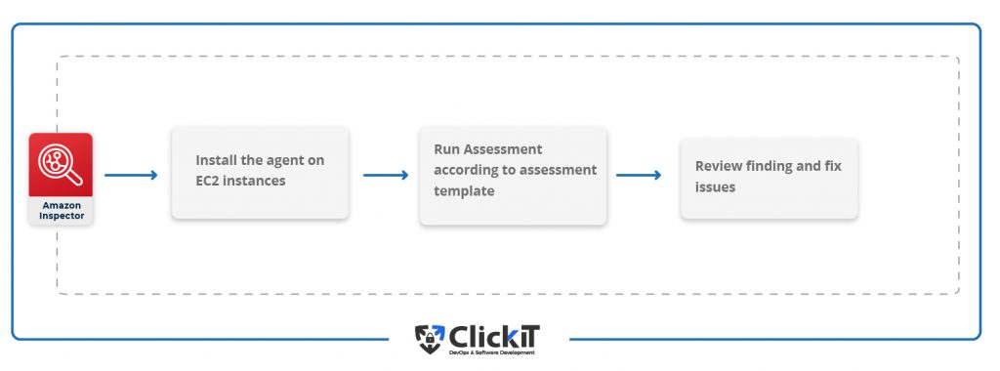

{: .no_toc }
<nav>
  <h4>Table of Contents</h4>
  * this unordered seed list will be replaced by toc as unordered list
  {:toc}
</nav>

# Cloud security features
In this section, I will show the results of an experiment with security features and options in the cloud. I have chosen the AWS cloud. This task will be also helpful to me for next semester (graduation) because my next project is also related to AWS cloud security.

## 1. Identity Access Management (IAM)

IAM is a free feature of AWS that manages what users have access to what services and resources. Access to resources is denied by default, so we’ll have to grant users permissions in IAM. Permissions are incredibly granular, allowing specifying the resource a user can access, what they can do with the resource, and what conditions have to be true for the permissions to be active - for example, accessing AWS from a specific IP address. Here are some best practices that should consider with IAM: [[1]](#1)

Create groups. A group is a collection of users that allow you to specify permissions for those users. This makes it easier to track who has what permissions, as well as add permissions to many users at once. For example, a group called Admins could be given free reign over AWS, while another group, Developers, may only be given access to Lambda and S3.
Grant least privilege. Grant users only the permissions they need to perform the tasks they need to perform, and nothing more. We can always grant more permissions, but you can’t get back the databases that were deleted because we made everyone an admin. [[1]](#1)

## 2. multi-factor authentication

Enable multi-factor authentication, or MFA, for all users. MFA means that, once a user signs in, they’ll have to enter an additional code that is sent to them through a secondary device, like a smartphone. With MFA enabled, even if a user’s password is compromised, their account won’t be accessible. [[1]](#1)

## 3. AWS Shield

AWS Shield is a fully-managed distributed denial-of-service (DDoS) protection service. Shield is enabled by default as a free standard service with protection against common DDoS attacks against your AWS environment.

Shield Advanced goes a step further by integrating with AWS WAF to prevent a wide variety of malicious traffic from reaching your websites and applications. It can cover multiple accounts under an organization to ensure that all of your organization's internet-facing endpoints are protected from attackers. [[2]](#2)

## 4. AWS Secrets Manager
AWS Secrets Manager is a managed service where you can store and retrieve sensitive information such as database credentials, certificates, and tokens. Use fine-grained permissions to specify exact actions an entity can perform on the secrets, such as creating, updating, deleting, or retrieving secrets.

Secrets Manager also supports automatic rotation for AWS services such as Amazon Relational Database Service (RDS). Through Lambda functions, secrets for other services can be automatically rotated as well. Never store your sensitive information in source control management systems, such as Git. Always use a tool like Secrets Manager. [[2]](#2)

## 5. CloudTrail 

It's a tool used for tracking user activity, demonstrating compliance, and performing security analysis. CloudTrail creates logs that can be searched to review activity. It’s set up by default, so as long as you have an AWS account you can view the logs. CloudTrail is useful for determining if your security configuration is sufficient. From the CloudTrail logs you can view: [[1]](#1)

1. The source IP address of API calls
2. Updates to AWS services
3. Which account created, modified, or destroyed different AWS resources

Example
If you have enabled Cloudtrail in your account, you can track account activity within an average of about 15 minutes of an API call. If you are not sure of the owner of the resources created in your account, you can check the trail, get to know about it, and take the appropriate action on the help. [[3]](#3)

## 6. Amazon GuardDuty

Amazon GuardDuty uses machine learning to look for malicious activity in AWS environments. It combines the CloudTrail event logs, VPC Flow Logs, S3 event logs, and DNS logs to continuously monitor and analyze all activity. GuardDuty identifies issues such as privilege escalation, exposed credentials, and communication with malicious IP addresses and domains. It can also detect when the EC2 instances are serving malware or mining bitcoin. [[2]](#2)

Example
If you have your Banking Application deployed in AWS and S3, EC2, RDS and, a few of the services that you are using, then unusual Amazon S3 discovery API calls, unauthorized creation of new IAM users, roles, or access keys, resource hijacking of Amazon EC2 instances, generating Amazon RDS snapshots are a few of suspicious behavior the machine learning model of Guard Duty can now help you detect in your account. [[3]](#3)

## 7. Amazon Macie

Amazon Macie discovers and protects the sensitive data stored in AWS S3 buckets. It first identifies sensitive data in the buckets, such as personally-identifiable information or personal health information, through discovery jobs. We can schedule these jobs to monitor new data added to the buckets. After it finds sensitive data, Macie continuously evaluates the buckets and alerts us when a bucket is unencrypted, is publicly accessible, or is shared with AWS accounts outside of the organization. [[2]](#2)

## 8. S3 Security 

Amazon’s Simple Storage Service, or S3, provides data storage with high durability and availability. Like other services, S3 denies access from most sources by default. Only bucket and object owners (the AWS account owner) have read/write access by default. Be sure to lock down the S3 buckets to prevent unauthorized users from viewing, uploading, or deleting the files. Unlike other services, there are multiple ways of adding permissions to S3, such as:

1. Applying IAM roles to specific users within your AWS account. They can be used to specify what users have access to S3 buckets and what they’re allowed to do.
2. Using Access Control Lists to control access for AWS accounts, not individual users. These are useful if your organization uses multiple AWS accounts or other organizations need access to your files.
3. Using Bucket Policies to lock down a single bucket. Permissions can be added to individual users or entire AWS accounts. Bucket policies can be useful if some files in your application are private and some are public.

## 8. AWS Inspector

AWS Inspector is an automated security assessment service. It helps to improve the compliance and security of the applications deployed on the AWS Cloud and achieve Cloud Security. It automatically assesses applications for vulnerabilities, exposure, and deviations and produces a detailed report of security findings prioritized by severity level. Amazon Inspector checks for unexpected network accessibility of EC2 instances and vulnerabilities on those EC2 instances. [[3]](#3)

Example
When it comes to the financial sector, governments enact several regulations at a local and national level, which can be challenging to identify. In this case, Amazon Inspector can come to the rescue to enable scheduled vulnerability scan audits periodically. This can give confidence to the organization to say that they are adhering to the best practices and regulatory requirements. [[3]](#3)

##  References

[1] Top 4 AWS Security Features That Keep Your Cloud Secure. (n.d.). DragonSpears. [https://www.dragonspears.com/blog/top-4-aws-security-features-that-keep-your-cloud-secure](https://www.dragonspears.com/blog/top-4-aws-security-features-that-keep-your-cloud-secure)

[2] The Top 10 Security Tools for Your AWS Environment. (n.d.). Top AWS Managed Cloud Service Provider | Mission. [https://www.missioncloud.com/blog/the-top-10-security-tools-for-your-aws-environment](https://www.missioncloud.com/blog/the-top-10-security-tools-for-your-aws-environment)

[3] Top 10 Best AWS Security Practices for Financial Services. (n.d.). ClickIT. [https://www.clickittech.com/aws/aws-security/](https://www.clickittech.com/aws/aws-security/)

