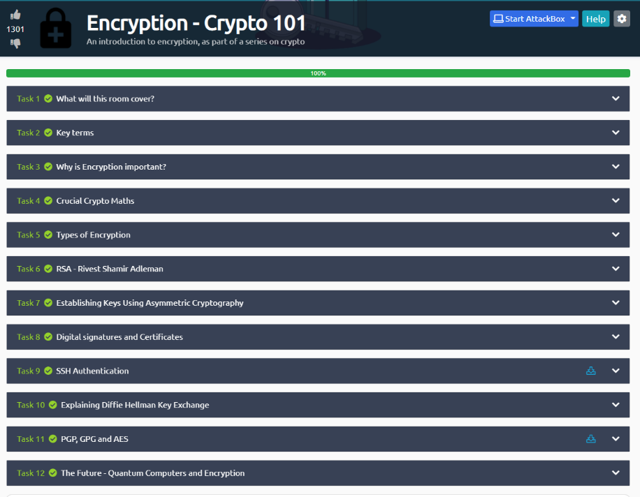
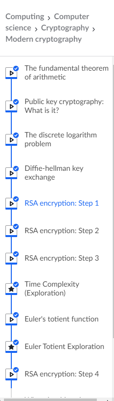

# Cryptography 

**Concepts of cryptography**

Cryptography is associated with the process of converting ordinary plain
text into unintelligible text and vice-versa. It is a method of storing
and transmitting data in a particular form so that only those for whom
it is intended can read and process it.

**Symmetric encryption**

Symmetric encryption is a type of encryption in which electronic data is
encrypted and decrypted using only one key (a secret key). The key must
be exchanged between the organizations communicating using symmetric
encryption so that it may be utilized in the decryption process.[[1]](#1)

Data is changed to a form that cannot be understood by anybody who does
not have the secret key to decrypt it by using symmetric encryption
methods. Once the message has been delivered to the intended recipient
who holds the key, the algorithm reverses its actions, returning the
message to its original and comprehensible state. The secret key used by
both the sender and the recipient can be a specific password/code or a
random string of letters or numbers created using a secure random number
generator (RNG). The symmetric keys must be generated using a RNG that
is certified according to industry standards, such as FIPS 140-2, for
banking-grade encryption.[[1]](#1)

While symmetric encryption is an older kind of encryption, it is faster
and more efficient than asymmetric encryption, which strains networks
due to data capacity limitations and excessive CPU usage. Symmetric
cryptography is commonly used for bulk encryption / encrypting massive
volumes of data, such as database encryption, due to its superior
performance and speed (relative to asymmetric encryption). In the case
of a database, the secret key may be used to encrypt or decrypt data
exclusively by the database. [[1]](#1)

Some examples of where symmetric cryptography are used:

-   Payment applications, such as card transactions where PII needs to
    be protected to prevent identity theft or fraudulent charges.

-   Validations to confirm that the sender of a message is who he claims
    to be.

-   Random number generation or hashing. [[1]](#1)

**Asymmetrical Encryption**

Asymmetric encryption uses two keys to encrypt plain text. The keys are
exchanged over the Internet or large networks. It ensures that malicious
people will not abuse the key. It should be noted that anyone with the
key can decrypt the message, which is why asymmetric encryption uses two
related keys to improve security. Anyone who wants to send you a message
can use the public key for free. The second private key is kept secret,
so you can only know it. [[2]](#2)

Messages encrypted with the public key can only be decrypted with the
private key, and messages encrypted with the private key can also be
decrypted with the public key. The security of the public key is not
required because it is publicly available and can be delivered over the
Internet. Asymmetric keys have better capabilities in ensuring the
security of information transmitted in the communication process. [[2]](#2)

Asymmetric encryption is mostly used in day-to-day communication
channels, especially over the Internet. Popular asymmetric key
encryption algorithm includes EIGamal, RSA, DSA, Elliptic curve
techniques, PKCS. [[2]](#2)

**What cryptographic vulnerabilities can be present in applications and
systems?**

Cryptography can go wrong in many different ways. Some of the most
common mistakes are trying to use insecure or custom algorithms, using
algorithms with known weaknesses, and completely abusing cryptography.

**Roll your own cryptography**

Using custom and secret encryption algorithms seems to protect data
confidentiality better than known algorithms. If no one knows how the
algorithm works, then it should be harder to crack it.

The problem with this theory is that most people are not trained
cryptographers, and even trained cryptographers make mistakes when
developing cryptographic algorithms. For every well-known and trusted
encryption algorithm in use today, there are others that seemed like a
good idea at the time but have fatal weaknesses.

**Use weak/corrupted encryption algorithms**

Another common mistake when using cryptography is to use algorithms that
are known to be weak or corrupted. Over the years, many algorithms have
been declared invalid due to vulnerability to brute force attacks (such
as DES or MD5) or defects in the protocol itself (such as those failed
AES candidates).

This error is most common in hashing algorithms, because many of the
most famous and commonly used encryption algorithms have existed for
many years and are still secure (such as AES). Hash algorithms are also
often used in long-lived applications, which makes them difficult to
change.

**Incorrect use of cryptography**

Even if the application uses a secure encryption algorithm, there may
still be problems. This is because cryptography is only safe when used
correctly.

Cryptographic algorithms usually have rules governing how they are used
safely. For example, it is important that the random value (random
number and IV) and the key to the stream cipher are used only once. If
you don\'t do this, you may be attacked.

The following screenshot is proof of
studying the crypto 101 modules on tryhackme. In this model, I refreshed
my knowledge about types of encryptions, and I learned basic information
about PGP and GPG, and AES.

## The mathematical basics of RSA and Diffie Hellman

**Diffie Hellman**

Let's say that Bob and Alice want to comminate to each other. Alice and
Bob will agree publicly on a prime modulus and generator. In this case
will be g=3 and p =17. Alice will choose private random number (private
number), say 15.

Alice's public number = 3^15^ % 17 = 6.

Alice will send the public key to Bob. Bob will choose private random
number (private number), say 13 and will his public key and will send it
to Alice.

Bob's public number = 3^13^ % 17 = 12.

Alice and Bob will use the public number of each other to find the
shared secret number.

Shared secret number= Bob's public number ^Alice's\ public\ number^ %
17.

Shared secret number= 12 ^15^ % 17= 10.

# References

[1] Turner, D. S. P. M. (2021). Symmetric Key Encryption - why, where and how it’s used in banking. Cryptomathic.  [https://www.cryptomathic.com/news-events/blog/symmetric-key-encryption-why-where-and-how-its-used-in-banking](https://www.cryptomathic.com/news-events/blog/symmetric-key-encryption-why-where-and-how-its-used-in-banking)

[2] Seal, R. (2020, 16 februari). Asymmetrical Encryption Vs Symmetric Encryption vs Diffie Hellman (DH) algorithm. Linkedin.  [https://www.linkedin.com/pulse/asymmetrical-encryption-vs-symmetric-diffie-hellman-dh-rupak-seal/?articleId=6634837509388017666](https://www.linkedin.com/pulse/asymmetrical-encryption-vs-symmetric-diffie-hellman-dh-rupak-seal/?articleId=6634837509388017666)

[3] Unknown, U. (n.d.). How to Use UFW Firewall on Debian, Ubuntu, Linux Mint. LinuxBabe. [https://www.linuxbabe.com/security/ufw-firewall-debian-ubuntu-linux-mint-server](https://www.linuxbabe.com/security/modsecurity-apache-debian-ubuntu)
