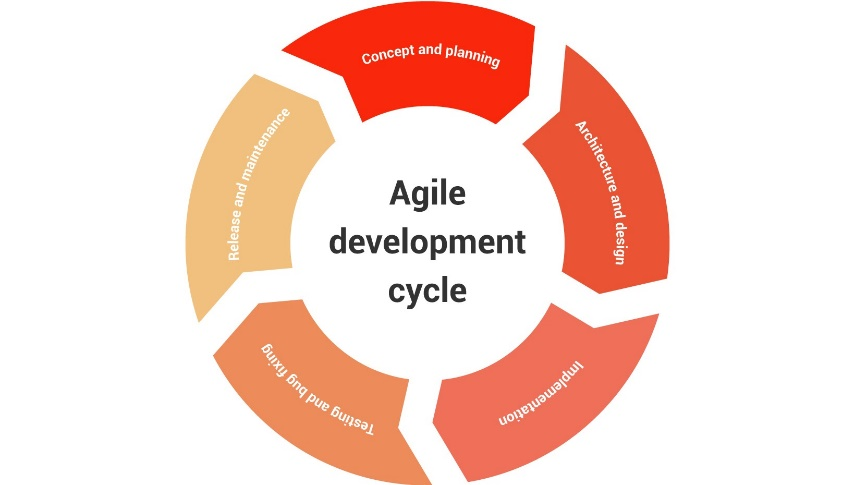

#  Secure Development Lifecycle (SDL)

The safe development lifecycle is a ready-made solution that gives a
systematic approach to application security (SDL). It is a collection of
development techniques aimed at improving security and compliance. These
techniques should be used at all levels of software development and
maintenance for optimum value. [[1]](#1)

**Benefits of SDL**

The most important reasons to adopt SDL practices are:

1. Higher security: In SDL, continuous monitoring for vulnerabilities
   results in better application quality and mitigation of business
   risks.

2. Cost reduction: In SDL, early attention to flaws significantly
   reduces the effort required to detect and fix them.

3. Regulatory compliance: SDL encourages a conscientious attitude
   toward security-related laws and regulations. Ignoring them may
   result in fines and penalties, even if no sensitive data is lost.

4. Development teams get continuous training in secure coding
   practices.

5. Security approaches become more consistent across teams.

6. Customers trust the team more, because they see that special
   attention is paid to their security.

7. Internal security improves when SDL is applied to in-house software
   tools.

---

**Agile development cycle**

The agile workflow, by contrast, goes through many cycles, each of which
contains the same set of
stages: [[1]](#1)

In the following sections, I provide an overview of these software
development stages and relevant SDL recommendations.

1.  **Concept and planning**

The purpose of this stage is to define the application concept and
evaluate its viability. This includes developing a project plan, writing
project requirements, and allocating human resources.

SDL practices recommended for this stage include:

1.  **SDL discovery**\
    **SDL discovery starts with defining security and compliance
    objectives for your project. Then select an SDL methodology and
    write a detailed plan of relevant SDL activities. This ensures that
    your team will address security issues as early as possible.

2.  **Security requirements**\
    Prepare a lisjt of security requirements for your project. Remember
    to include both technical and regulatory requirements. Having this
    list helps to easily identify and fix potentially non-compliant
    areas of your project.

3.  **Security awareness training**\
    Training sessions provide essential security knowledge ranging from
    basic threat awareness to in-depth information on secure
    development. Basic security training establishes a security mindset
    for all project participants. Advanced courses teach secure design
    principles to key project participants.

2.  **Architecture and design**

The purpose of this stage is to design a product that meets the
requirements. This includes modeling the application structure and its
usage scenarios, as well as choosing third-party components that can
speed up development. The result of this stage is a design document.

SDL practices recommended for this stage include:

1.  **Threat modeling**
    Threat modeling consists of identifying probable attack scenarios
    and adding relevant countermeasures to the application design.
    Modeling uncovers possible threats early, thus reducing the
    associated costs, and also lays the basis for future incident
    response plans.

2.  **Secure design**\
    The design document and subsequent updates are validated in light of
    the security requirements. Early design reviews assist in
    identifying features exposed to security risks before they are
    implemented.

3.  **Third-party software tracking**\
    Vulnerabilities in third-party components can weaken the entire
    system, making it important to monitor their security and apply
    patches when necessary. Regular checks of third-party software help
    to spot areas threatened by compromised components and fill in the
    gaps.

3.  **Implementation**

This is the stage at which an application is actually created. This
includes writing the application code, debugging it, and producing
stable builds suitable for testing.

SDL practices recommended for this stage include:

1.  **Secure coding**\
    Guides and checklists remind programmers of typical mistakes to be
    avoided, such as storing unencrypted passwords. Enforcing secure
    coding principles eliminates many trivial vulnerabilities and frees
    up time for other important tasks.

2.  **Static scanning**\
    Static application scanning tools
    ([SAST](https://www.ptsecurity.com/ww-en/analytics/knowledge-base/sast-dast-iast-and-rasp-how-to-choose/#1))
    review newly written code and find potential weaknesses without
    having to run the application. Daily use of static scanning tools
    uncovers mistakes before they can make their way into application
    builds.

3.  **Code review**\
    While automated scanning saves a lot of effort, manual code reviews
    are still a must for building secure applications. Timely reviews
    help developers to flag and fix potential issues before they shift
    attention to other tasks.

4.  **Testing and bug fixing**

The purpose of this stage is to discover and correct application errors.
This includes running automatic and manual tests, identifying issues,
and fixing them.

SDL practices recommended for this stage include:

1.  **Dynamic scanning**\
    Dynamic application scanner tools
    ([DAST](https://www.ptsecurity.com/ww-en/analytics/knowledge-base/sast-dast-iast-and-rasp-how-to-choose/#2))
    expose vulnerabilities by simulating hacker attacks at runtime. To
    reduce false positives, you can use a combined approach
    ([IAST](https://www.ptsecurity.com/ww-en/analytics/knowledge-base/sast-dast-iast-and-rasp-how-to-choose/#3)).
    This approach complements runtime scanning with monitoring of
    executed code and application data flow. In addition to discovering
    regular vulnerabilities, dynamic scanning pinpoints configuration
    errors that impact security.

2.  **Fuzzing**\
    Fuzz testing involves generating random inputs based on custom
    patterns and checking whether the application can handle such inputs
    properly. Automated fuzzing tools improve protection from attacks
    that use malformed inputs, such as SQL injection.

3.  **Penetration testing**\
    It is a good idea to invite a third-party team of security
    professionals to simulate possible attacks. External experts rely on
    their knowledge and intuition to reproduce attack scenarios that
    might be overlooked by your team.

Adopting these practices further reduces the number of security issues.
Combined with the activities from the previous stages, this provides
decent protection from a wide range of known threats.

5.  **Release and maintenance**

At this stage an application goes live, with many instances running in a
variety of environments. Eventually new versions and patches become
available, and some customers choose to upgrade, while others decide to
keep the older versions.

SDL practices recommended for this stage include:

1.  **Environment management**\
    Real attackers exploit environment configuration errors and
    vulnerabilities. Security monitoring must cover the entire system,
    not just the application. Such monitoring improves the overall
    security of your application.

2.  **Incident responses plan**\
    An incident response plan clearly describes the procedures your
    incident team must follow to address any security breaches that
    might occur. Swift execution of the response plan is crucial for
    triage and repair of security breaches.

3.  **Ongoing security checks**\
    Security checks must be repeated on a regular basis because new
    types of vulnerabilities are being discovered at a steady rate.
    Regular checks protect your application from newly discovered
    vulnerabilities.

6.  **End of life**

\"End of life\" is the point when software is no longer supported by its
developer. Applications that store sensitive data may be subject to
specific end-of-life regulations.

SDL activities recommended for this stage include:

1. **Data retention**\
   Governments define retention policies for some data types.
   Double-checking your company\'s retention policies for compliance
   with legal requirements reduces the risk of unexpected fines.

2. **Data disposal**\
   At the application\'s end of life, all sensitive data stored in it
   must be purged carefully. Examples of such data are encryption keys
   and personal information. Proper data disposal at the end of life
   keeps such information confidential and prevents data breaches.

---

# References

[1] Positive Technologies. (2020, February 25). How to approach secure software development. Positive Technologies - vulnerability assessment, compliance management and threat analysis solutions.  [https://www.ptsecurity.com/ww-en/analytics/knowledge-base/how-to-approach-secure-software-development/](https://www.ptsecurity.com/ww-en/analytics/knowledge-base/how-to-approach-secure-software-development/)