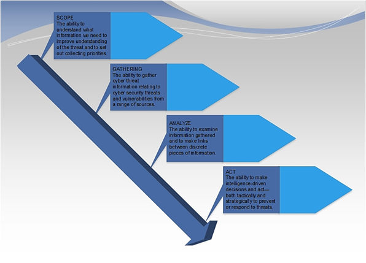
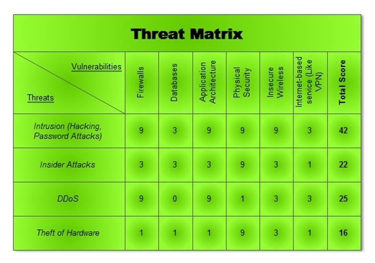

# Methodologies for threat analysis

### Components of threat analysis

**Scope**

The scope includes the information, features of the asset or software,
and the threat environment that will be included in the analysis. [[3]](#3)

**Data Collection**

An IT analyst must have unrestricted access to data to transform it into
intelligence that will inform their threat analysis. Sources of
information are, for example, intrusion incidents, detection system
logs, reported exploitations, firewall logs, etc. [[3]](#3)

**Threat analysis**

In this phase, systems, assets, and enterprise security tools are tested
and evaluated against the information gathered to determine where
potential threats could be. For each threat identified, the organization
will also determine the probability that the threat will be realized as
well as the potential impact(s) if the threat is exploited. These
potential impacts can be categorized by those that impact the
availability, confidentiality and integrity of the system or data it
processes or stores. [[3]](#3)

**Mitigation and acceptance**

Once all threats have been identified, the organization must then
determine which vulnerabilities will be mitigated and which will be
accepted. This acceptance can be due to the cost or difficulty of the
remediation, its low probability of occurrence, or even its potential to
disrupt business services if altered.  Whatever the decision, each
action, and decision should have the approval of the organization's
executives, confirming that they agree with the resolution. [[3]](#3)

## Threat actors

A threat actor is anyone who is either is a key driver of, or
participates in, a malicious action that targets an organization\'s IT
security. [[1]](#1)

The following types are the types of the threat actor:[[2]](#2)

**Organized Cybercriminals**

These are folks that are only interested in making money. The
information they steal will be sold on the black market to the highest
bidder.

Their major weapon of choice is ransomware, which is being used for
old-fashioned extortion in a modern setting and has witnessed a dramatic
spike in 2020. Cybercriminals and gangs typically target cash- or
data-rich organizations, while individuals and home networks have also
been targeted.

**Cyber Terrorists**

To achieve their cause, cyber terrorists use a variety of cyber weapons
to disrupt essential services and commit damaging crimes. In general
(though not solely), they target state operations, corporations, and key
services that will have the most impact.

**Inside Agents and Bad Actors**

Certain threat actors will infiltrate a workforce, or express grievances
via criminal activity, or turn insiders towards their cause with the
promise of financial reward. This is an especially malevolent threat,
because insiders have privileged access. As this method's popularity has
grown, organizations are learning that they must be on guard against the
risk that their own employees might turn against them. Disgruntled
former employees are especially targeted by bad guys.

**State-Sponsored Threat Agents**

This type of cybercriminals is either directed or supported by nations
and national governments, or both. As part of national espionage
programs, they have been known to exfiltrate data, steal critical
information, and reroute funds. Their purpose is to spy on or steal from
businesses or government agencies to further an enemy nation\'s
interests.

**Script Kiddies**

Script kiddies are threat actors without the skill or knowledge required
to design bespoke penetration tools, and yet will happily purchase or
borrow the tools of other attackers to infiltrate systems. They'll
generally seek out system weaknesses and take advantage of
vulnerabilities to vandalize computer systems, wreaking indiscriminate
damage.

**Hacktivists**

Ideologies are powerful, and in an era of increased awareness-raising,
there has been an unprecedented rise in hacktivism or hacking with the
goal of raising awareness about particular topics, whistleblowing, or
exposing secrets. WikiLeaks is probably the most well-known example of
hacktivism, which was founded with the expressed intention of exposing
secrets and altering perceptions of government activities.

**Human Error**

The simple truth is that not all threat actors are either malicious or
intentional. Despite this, mistakes - even seemingly benign ones - have
the potential to cause massive damage to business networks. Internal
user errors also result in system vulnerabilities which can then be
taken advantage of by other threat actors. As with all criminals, many
cybercriminals are opportunists who rely on errors, mistakes, or
laziness when it comes to security protocols and love a badly managed
network.

## Approaches to cyberthreat analysis

**Threat metrics**

The process of threat measurement can help an organization capture and
identify trends in system behavior and help to identify when anomalies
occur. It can also underscore the prominence of certain types of
vulnerabilities or be used to link unusual behavior to potential
consequences.

Measuring and reporting on threats in a structured way has a lot of
advantages. These include the ability to make data-driven decisions
about security controls or investments, or justification for system
changes. [[3]](#3)

**The threat matrix**

A threat matrix uses attributes of a threat to help the analyst
characterize the type of threat based on its overall nature. This kind
of characterization allows analysts to describe the threat's full
spectrum while reducing the amount of subjectivity woven into their
analysis. In other words, a threat matrix introduces levels, organized
by characteristics or levels of magnitude, to consistently measure or
describe each threat. [[3]](#3)

The following picture is a simple example of the threat matrix:

## STRIDE

The STRIDE was initially created as part of the process of threat
modeling. STRIDE is a model of threats, used to help reason and find
threats to a system. It is used in conjunction with a model of the
target system that can be constructed in parallel. This includes a full
breakdown of processes, data stores, data flows, and trust boundaries.
\[11\]

The threats are:

1. Spoofing

2. Tampering

3. Repudiation

4. Information disclosure (privacy breach or data leak)

5. Denial of service

6. Elevation of privilege

Each threat is a violation of a desirable property for a system:

|  **Threat**            | **Desired property** |
| ---------------------- | -------------------- |
| Spoofing               | Authenticity         |
| Tampering              | Integrity            |
| Repudiation            | Non-repudiability    |
| Information disclosure | Confidentiality      |
| Denial of Service      | Availability         |
| Elevation of Privilege | Authorization        |

## Attack Trees

Attack trees concept is a structured and hierarchical way to logically
collect and document the anticipated or likely attacks on a given
system. The tree decomposes the threat agents depending on the type of
attack each agent utilizes.

**Pros of attack trees**

1.  It provides a direct and transparent mode for analysis of attack
    agents

2.  The model encourages the use of deductions or conclusions which can
    be harnessed for quality output.

3.  They are highly flexible, hence can cover the entire spectrum of
    threats and attack agents in the entire platform.

4.  It is compatible with other models and data from attack trees can be
    used in analysis using a different model.

**Where will I use methodologies for threat analysis?**

In the first phase of the implementation of the group project, we will
work on threat analysis of the project. I will add the results of the
threat analysis of the group project here.

# References

[1] What is a Threat Actor and Why Should You Care? (2021). Home sophos.  [https://home.sophos.com/en-us/security-news/2021/what-is-a-threat-actor.aspx](https://home.sophos.com/en-us/security-news/2021/what-is-a-threat-actor.aspx)

[2] StackPath. (2021). Security Info Watch. [https://www.securityinfowatch.com/cybersecurity/article/21207268/7-cyber-threat-actors-to-watch-for-in-2021](https://www.securityinfowatch.com/cybersecurity/article/21207268/7-cyber-threat-actors-to-watch-for-in-2021)

[3] Cyber threat analysis [updated 2021]. (2021, 25 juli). Infosec Resources.  [https://resources.infosecinstitute.com/topic/cyber-threat-analysis/](https://resources.infosecinstitute.com/topic/cyber-threat-analysis/)
