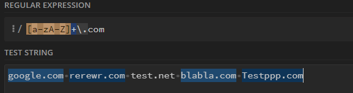
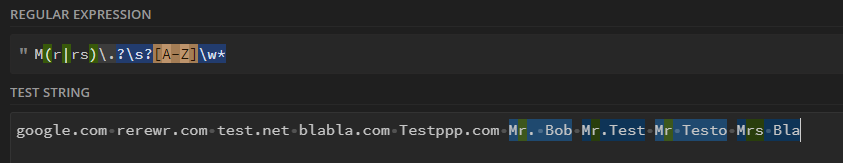
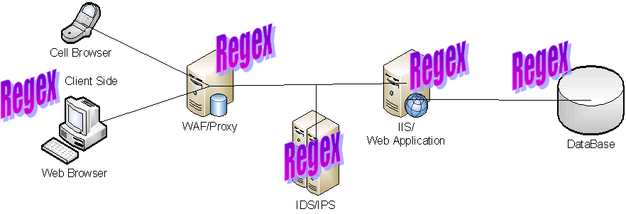

# Regular expressions

is a character sequence that indicates a search pattern.
String-searching algorithms typically use such patterns for string
\"find\" or \"find and replace\" operations, as well as input
validation.\[14\]

**List of values:**

| .      | Any character except new line      |
| \\d    | Digit (0-9)                            |
| \\D    | Not a digit (0-9)                      |
| \\w    | Word character                         |
| \\s    | Whitespace (space, tab, newline)       |
| \\b    | Word boundary                          |
| \\B    | Not a word boundary                    |
| ^      | Beginning of a string                  |
| \[\]   | Matches characters in brackets         |
| \[^ \] | Matches characters Not in brackets |
| \|     | Either or                              |
| ()     | Group                                  |
| \*     | 0 or More                              |
| +      | 1 or More                              |
| ?      | 0 or one                               |
| {3}    | Exact number                           |
| {3,4}  | Range of numbers                       |

**Regex pattern**

The following screenshot contains the regex pattern that I used to find
the domain name of the website that end with ".com'

The following screenshot contains the regex pattern that I used to match
the first name that begins with "Mr.", "Mrs." including without the
point in some situations.

**Regular expression Denial of Service - ReDoS**

The Regular Expression Denial of Service (ReDoS) attack takes use of the
fact that most Regular Expression implementations can reach extreme
circumstances that cause them to work very slowly (exponentially related
to input size). An attacker can then utilize a Regular Expression
(Regex) to cause a program to encounter these severe circumstances and
hang for a lengthy period.

**Attacks**

The attacker might look for applications that use Regular Expressions,
containing an Evil Regex, and send a well-crafted input, that will hang
the system. Alternatively, if a Regex itself is affected by user input,
the attacker can inject an Evil Regex, and make the system vulnerable.
\[15\]

**Risk Factors**

In every layer of the WEB there are Regular Expressions, that might
contain an Evil Regex. An attacker can hang a WEB-browser (on a computer
or potentially also on a mobile device), hang a Web Application Firewall
(WAF), attack a database, and even stack a vulnerable WEB server.

For example, if a programmer uses a Regex to validate the client side of
a system, and the Regex contains an Evil Regex, the attacker can assume
the same vulnerable Regex is used in the server side, and send a
well-crafted input, that stacks the WEB server.

**Examples**

The following Regex for email validation. This regex is an **Evil
regex**

Regex:
\^(\[a-zA-Z0-9\])((\[\\-.\]\|\[\_\]+)?(\[a-zA-Z0-9\]+))\*(@){1}\[a-z0-9\]+\[.\]{1}((\[a-z\]{2,3})\|(\[a-z\]{2,3}\[.\]{1}\[a-z\]{2,3}))\$

Input:

aaaaaaaaaaaaaaaaaaaaaaaa!

##  