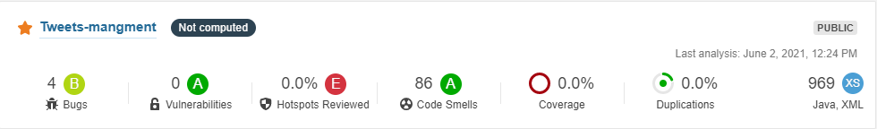

# Review the source code of an open-source tool
# 

## What is Secure Code Review?

Code review aims to identify security flaws in the application related
to its features and design, along with the exact root causes.[[1]](#1)

The traditional way of testing may fail to detect all the security flaws
present in the applications. One must understand the code of the
application, external components, and configurations to have a better
chance of finding the flaws. Such a deep dive into the application code
also helps in determining exact mitigation techniques that can be used
to avert security flaws. [[1]](#1)

Secure code review allows a company to assure application developers are
following secure development techniques. A general rule of thumb is that
a penetration test should not discover any additional application
vulnerabilities relating to the developed code after the application has
undergone a proper security code review. At the least, very few issues
should be discovered. [[1]](#1)

Tools are good at assessing large amounts of code and pointing out
possible issues, but a person needs to verify every result to determine
if it is a real issue if it is actually exploitable and calculate the
risk to the enterprise. Human reviewers are also necessary to fill in
for the significant blind spots, which automated tools, simply cannot
check. [[1]](#1)

## SonarQube and code review

In S6, I was working on a personal project to develop a Twitter clone. I
used Java to develop the application. To review the code with a tool, I
used the Sonar cloud to review my code after each push to the
repository.

The following screenshot is de results of sonar cloud after reviewed my
code. According to sonar cloud my code has 4 bugs and 86 smells code
with 0 vulnerabilities. These results must be reviewed manually to
ensure the existing of the bugs and to improve the code quality and
finding hidden vulnerabilities.

{width="6.268055555555556in"
height="0.9208333333333333in"}

{width="5.142857611548556in"
height="3.8243810148731407in"}

## Code review with Codacy

The Codacy is one of the tools to review the source code to find code
issues or vulnerabilities. I did a review for a big project with
contains many services. In the tool dashboard, we can find the results
of the review.

The following screen shot is the results of tool. There is no security
issues find and the rest o the issues is about the code style.

# References

[1] OWASP Code Review Guide v2. (2017, June). OWASP.  [https://owasp.org/www-pdf-archive/OWASP_Code_Review_Guide_v2.pdf](https://owasp.org/www-pdf-archive/OWASP_Code_Review_Guide_v2.pdf)