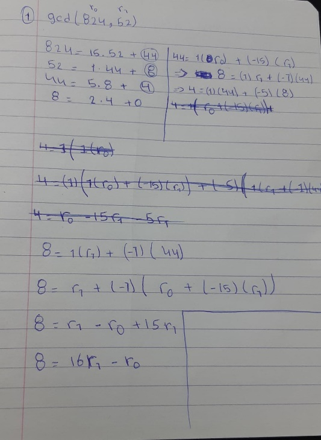
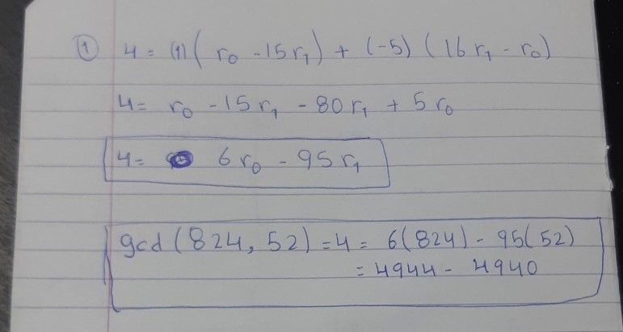
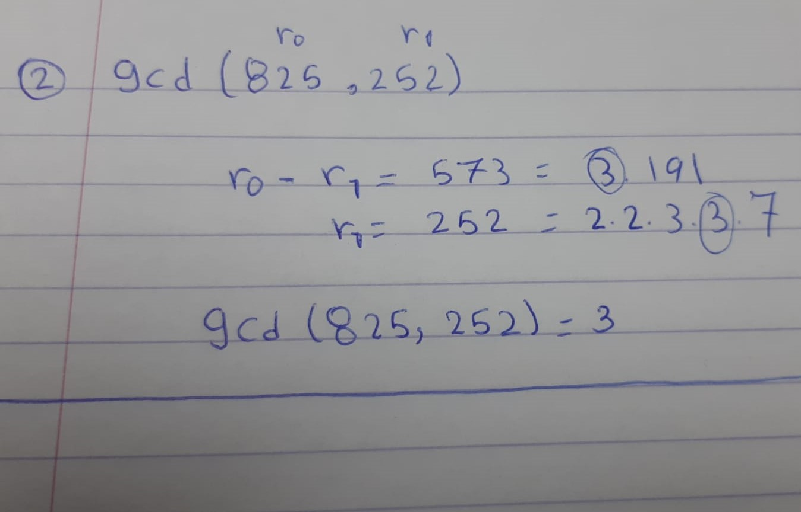
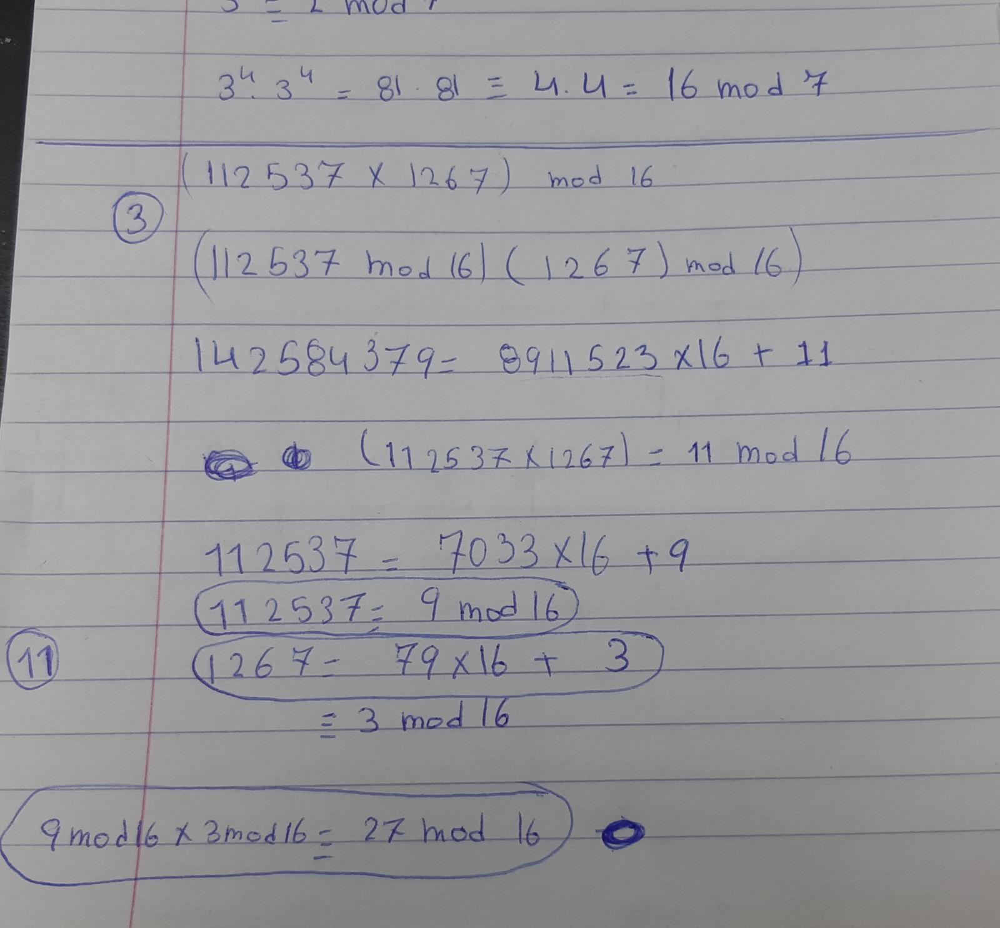
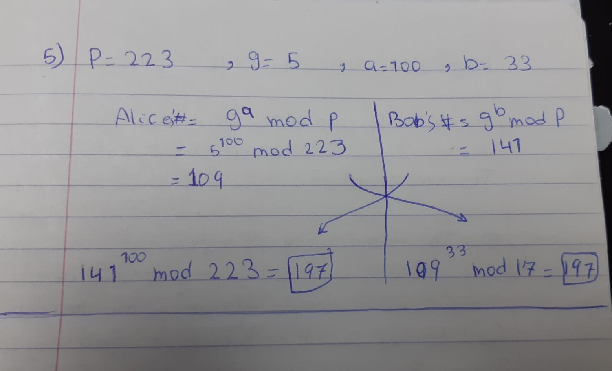
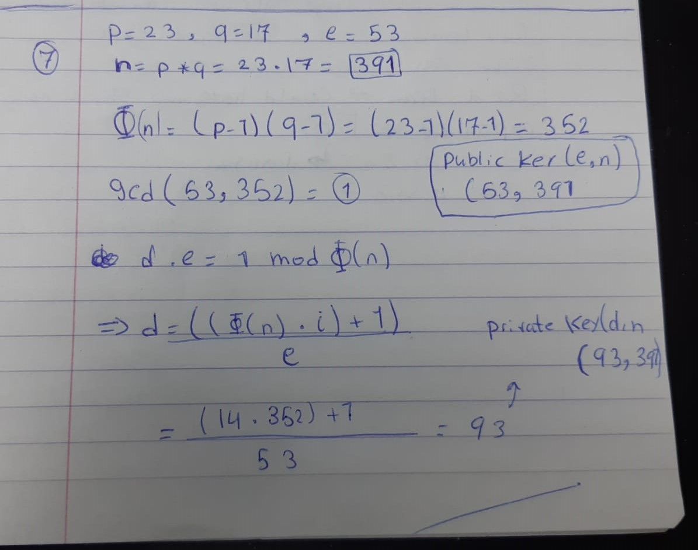

# The mathematical basics of RSA (and Diffie Hellman) public key cryptography

In this section, I studied the basic math of RSA and generating the
public and private keys. I used the book in Canvas. I studied the rules,
and then I did some simple examples that I got online. After that, I
moved on to the exercises that are given in Canvas.

To prove that task, I will show the questions that I did with the
answers.

1.  Euclid\'s algorithm: Calculate the gcd (824, 52) using the Euclid\'s
    algorithm

The following screen shorts is the answer to the question.

2.  Prime factorization: Calculate the gcd via prime factors
    factorization (825, 252)

> The following screen shorts is the answer to the question.

3.  Modular arithmetic: Simplify (as far as possible) and calculate
    (112537 x 1267) mod 16

> 

4.  Calculate the shared key as a result of the Diffie Hellman key
    exchange.\
    Alice and Bob want to agree on a common key via the Diffie Hellman
    key exchange algorithm. They decide to use a prime number p = 223
    and base g = 5.\
    Alice chooses a random value a = 100.\
    For Bob choose a random value b = 33.\
    Calculate the shared key K.

5.  Given is:\
    p = 23, q = 17, and e = 53 is chosen as public exponent, as
    indicated in the attached formula sheet.\
    Calculate the public key (e, n) and the private key (d, n)

