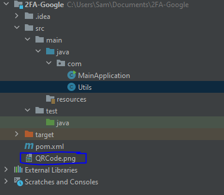

# Two Factor Authentication (2FA)

It is an additional, a layer of safety used to ensure that individuals
attempting to access a web-based record are who they say they are.
Initial, a client will enter their username and a secret key. Then, at
that point, rather than quickly obtaining entrance, they will be needed
to give one more snippet of data.[[1]](#1)

Two-factor verification (2FA) is the basic component of a zero-trust
security model. To ensure delicate information, you should check that
the clients attempting to get to that information are who they say they
are. 2FA is a powerful method to ensure against numerous security
dangers that target client passwords and records, for example, phishing,
savage power assaults, certification abuse and that\'s just the
beginning.[[2]](#2)

## What are the Factors of Authentication?

Elements are the snippets of data a client can give to check their
personality. 2FA is the most ordinarily utilized, yet there are, indeed,
five components of confirmation utilized by security experts
today.[[2]](#2)

### Knowledge Factor

 
The knowledge factor verifies identity by
requesting information only an individual user would know. The most
common example of a knowledge factor of authentication is a password. A
user's password should be private only to them, allowing them to use it
as a method to confirm their identity. [[2]](#2)

### Possession Factor

Possession Factor confirm the character of a client by requiring
verification of data that main the client ought to have. Tokens are a
normally utilized belonging component of verification. [[2]](#2)

### Inherence Factor

Inherence factors of authentication verify the identity of a user by
using attributes that would belong only to that user. Fingerprint
scanning is the most obvious inherence factor used today. [[2]](#2)

### Location Factor
  

Location factors of authentication confirm the identity of a user based
on their location in the world. If a user had registered an account in
one country, for example, and suddenly there are login attempts from
another, location factors could trigger and attempt to verify the
identity of the new user. Many location factors are based on the IP
address of the original user and compares the address to that of the new
attempt to access information. [[2]](#2)

### Time Factor

Time factors of authentication verify the
identity of a user by challenging the time of the access attempt. This
is based on the assumption that certain behaviors (like logging into a
work computer) should happen within predictable time ranges. If an
attempt to access a platform happens outside of the usual time range,
the attempt can be challenged or terminated until a user can verify
their identity. [[2]](#2)

## What Threats Does 2FA Address?

The need for two-factor authentication has increased as companies,
governments, and the public realize that passwords alone are not secure
enough to protect user accounts in the current technical landscape. In
fact, the average cost of data breaches today is over two trillion
dollars annually. While 2FA protects against a multitude of threats, the
most common threats include: [[2]](#2)

### Stolen Passwords

A traditional password can be used by
anybody who gets their hands on it. If a user writes down their password
on a pad of paper, for example, that password can be stolen to gain
access to an account. 2FA, by contrast, validates the user with a second
device after a password is entered. [[2]](#2)

### Phishing Attempts

Hackers will often send emails that include links to malicious websites designed to either infect a user's computer
or convince them to enter their passwords. Once obtained, a password can
be used by whoever manages the hacking attempt. 2FA fights phishing by
adding a second layer of validation after the password has been entered.
[[2]](#2)

### Social Engineering

Hackers will often simply manipulate users into giving up
their passwords. By posing as an IT professional at the user's company,
they can earn the trust of the user before asking for login credentials.
2FA protects against this by validating the location and IP of every
login attempt after a password has been entered. [[2]](#2)

### Brute-Force Attacks

In a brute-force attack, a hacker randomly
generates passwords for a specific computer until they land on the
correct sequence. 2FA's second layer of protection requires a login
attempt to be validated before granting access. [[2]](#2)

### Key Logging

Even if a user hasn\'t written down their
password, hackers can use malware to track and copy a user's password as
they type. Hackers track every keystroke and store the password to be
used later. The second layer of validation in 2FA lets a user ensure
that the login attempt is their own, even if their password has been
compromised. [[2]](#2)

## What are the types of 2FA?

There are a number of different second factors that can be used to
verify a user\'s identity. From passcodes to biometrics, the available
options address a range of use cases and protection levels.

### SMS 2FA

SMS two-factor authentication validates the identity of a user by
texting a security code to their mobile device. The user then enters the
code into the website or application to which they\'re authenticating.
[[2]](#2)

| Pros                                                                                                                                                                                                                                                                            |  Cons                                                                                                                                                                                                                                                          |
| ------------------------------------------------------------------------------------------------------------------------------------------------------------------------------------------------------------------------------------------------------------------------------- | ------------------------------------------------------------------------------------------------------------------------------------------------------------------------------------------------------------------------------------------------------------------- |
| **Simplicity.** SMS 2FA simply sends a confirmation code to a user's mobile phone. Just enter the code and gain access to your information.                                                                                                                                     | **Phone number requirements.** SMS 2FA requires that users disclose their phone numbers to a third party (the 2FA provider). This makes some people uncomfortable because it raises concerns around privacy, personal security, and being targeted for advertising. |
| **Speed and access.** If suspicious activity occurs, SMS 2FA sends a one-time password (OTP) to a user's device, so only the user with that device can log in and verify that their account hasn't been compromised. SMS 2FA is a quick way to validate the identity of a user. | **Data network requirements.** SMS 2FA requires a phone that can receive SMS messages. If a user's phone is missing or damaged, or if they cannot access their network, they may not be able to receive their security code.                                        |
| SMS 2FA is the oldest form of two factor authentication, so it has become a commonly accepted security protocol.                                                                                                                                                                |                                                                                                                                                                                                                                                                     |

### TOTP 2FA

The Time-Based One Time Password (TOTP) 2FA method generates a key
locally on the device a user is attempting to access. The security key
is generally a QR code that the user scans with their mobile device to
generate a series of numbers. The user then enters those numbers into
the website or application to gain access. The passcodes generated by
authenticators expire after a certain period of time, and a new one will
be generated the next time a user logs in to an account. TOTP is part of
the Open Authentication (OAUTH) security architecture. [[2]](#2)

| Pros                                                                                                                                                                                                                                                                                                                                |  Cons                                                                                                                                                                                                                                                   |
| ----------------------------------------------------------------------------------------------------------------------------------------------------------------------------------------------------------------------------------------------------------------------------------------------------------------------------------- | ------------------------------------------------------------------------------------------------------------------------------------------------------------------------------------------------------------------------------------------------------------ |
| **Flexibility.** This type of 2FA hinges on a QR code which generates a unique passcode. Once they have this code, a user can use it across multiple devices. By contrast, SMS 2FA is restricted to the device that receives the message. TOTP 2FA is more flexible and gives the user a wider ability to access their information. | **Reliance on devices.** TOTP 2FA requires the user to have a device capable of reading the QR code to verify their identity. If the user misplaces their device or the QR code, or if it’s stolen, they will no longer be able to access their information. |
| **Improved Access.** Mobile authenticators are able to remember which accounts a user is trying to access — so the user can access their passcode at any time, even if they are not on a cellular or wifi network.                                                                                                                  |                                                                                                                                                                                                                                                              |

### Push-Based 2FA

Push-based 2FA improves on SMS and TOTP 2FA by adding additional layers
of security, while improving ease of use for end users. Push-based 2FA
confirms a user\'s identity with multiple factors of authentication that
other methods cannot. Duo Security is the leading provider of push-based
2FA. [[2]](#2)

| Pros                                                                                                                                                                                                                                                                                                                                                                                                                                                                                                                                   |  Cons                                                                                                                                                                                                                                                                                                          |
| -------------------------------------------------------------------------------------------------------------------------------------------------------------------------------------------------------------------------------------------------------------------------------------------------------------------------------------------------------------------------------------------------------------------------------------------------------------------------------------------------------------------------------------- | ------------------------------------------------------------------------------------------------------------------------------------------------------------------------------------------------------------------------------------------------------------------------------------------------------------------- |
| **Phishing security.** Other types of two factor authentication are susceptible to phishing attacks, but push-based 2FA combats that vulnerability by replacing access codes with push notifications. When they attempt to access their information, a push notification is sent to the user’s phone. The notification includes information about the login attempt, such as location, time, IP address, and more. The user simply confirms that the information is correct and uses their phone to accept the authentication request. | **Reliance on data access.** Push-based 2FA sends its notifications through data networks like cellular or wifi networks. The user must have data access on their mobile device to use the 2FA functionality.                                                                                                       |
| **Ease of use.** Once set up, push-based 2FA streamlines the authentication process. If the information sent through the push notification is correct, the user simply accepts the login attempt through their mobile device and is able to access their account.                                                                                                                                                                                                                                                                      | **Reliance on user knowledge.** Push-based 2FA fights phishing by allowing the user to validate the location and other details associated with the login attempt. Security breaches may occur in cases when the user doesn’t pay attention to or correctly read information like the IP address and login location. |
| **Scalable.** Push-based 2FA can easily be scaled for organizations needing to secure multiple users. The ease of use allows teams to onboard the software and train teams on how to use it efficiently. Since every access attempt is confirmed with a mobile device, there are no SMS codes to enter or QR codes to save.                                                                                                                                                                                                            |                                                                                                                                                                                                                                                                                                                     |

### U2F Tokens

U2F tokens secure two-factor authentication by using a physical USB port
to validate the location and identity of a user attempting to login. To
use a U2F token, a user inserts the token into their device and presses
the button located on the top of the device. Once the token is
activated, the user enters their PIN and gains access to their accounts.
[[2]](#2)

| Pros                                                                                                                                             |  Cons                                                                                                                                                                                                |
| ------------------------------------------------------------------------------------------------------------------------------------------------ | --------------------------------------------------------------------------------------------------------------------------------------------------------------------------------------------------------- |
| Phishing protection. Since the user must physically hold, insert, and enter a code into the token, U2F protects a user's PIN from being phished. | Lack of support. U2F tokens are still relatively new to the 2FA world, which means that many currently existing technologies do not support it.                                                           |
| Backup devices and codes. U2F tokens can be backed up across multiple devices, allowing users to replace their token or code if it is lost.      | Requires a physical object. As a physical token, this security method is susceptible to being lost or damaged. If a token is misplaced, for example, it cannot be used to authenticate a user’s identity. |
| Ease of use**.** U2F tokens require little set up or technical knowledge to use.                                                                 |                                                                                                                                                                                                           |

### Web Auth

Created by the FIDO (Fast IDentity Online) Alliance and W3C, the Web
Authentication API is a specification that enables strong, public key
cryptography registration and authentication. WebAuth (Web
Authentication API) allows third parties like Duo to tap into built-in
capabilities on laptops, smartphones, and browsers, letting users
authenticate quickly and with the tools they already have at their
fingertips. [[2]](#2)

| Pros                                                                                                                                                                                                                                                                                                                                                                                                         |  Cons                                                                                                                                                                                                                                                                                                                                                                                                                                                                                                                                                                                                                                                                                                                                                             |
| ------------------------------------------------------------------------------------------------------------------------------------------------------------------------------------------------------------------------------------------------------------------------------------------------------------------------------------------------------------------------------------------------------------ | ---------------------------------------------------------------------------------------------------------------------------------------------------------------------------------------------------------------------------------------------------------------------------------------------------------------------------------------------------------------------------------------------------------------------------------------------------------------------------------------------------------------------------------------------------------------------------------------------------------------------------------------------------------------------------------------------------------------------------------------------------------------------- |
| **Convenience.** All you need is a supported web browser, operating system and authentication method -- such a biometric indicator, a security key (such as a Yubikey), or a system-local PIN -- for phishproof access.                                                                                                                                                                                      | **Complex account recovery.** In the modern workplace, work doesn’t stop when a security issue arises. Perhaps an employee loses their phone, or someone reports an unauthorized access attempt. Security measures help control these threats, but employees are expected to be back up and running and working as normal shortly after the incident. Many 2FA solutions make this relatively easy — a systems administrator can help with account recovery. A WebAuthn credential, however, is strongly tied to a specific individual device, making account restoration more difficult. For that reason, it’s still recommended that users have another out-of-band form of authentication to fall back on, should they lose access to their WebAuthn authenticator. |
| **More secure.** WebAuthn is one of the more secure 2FA methods available today. It allows web applications to trust a strong biometric authentication as a credential that is specific only to that service — which means no more shared passwords. We now have a secure means to generate, store and utilize a credential whose attributes are unknown to the user and thus can’t be stolen and exploited. |                                                                                                                                                                                                                                                                                                                                                                                                                                                                                                                                                                                                                                                                                                                                                                        |

## Two-Factor Authentication with Java

To prove this task, I will develop a 2FA auth using the Google
authenticator app. The application that will be developed will simulate
the login. To develop this, we will need the following list:

-   Email Gmail

-   Secret key

-   Google authenticator app

Google Authenticator requires 20 bytes secret key encoded as base32
string. We need to produce this key utilizing the accompanying code:

The next step is to have a method that will coverts base32 secret key to
hex and uses the TOTP to turn them into 6-digits codes based on the
current time.

We must run a method to generate time-base 6-digits code in sync with
Google Authenticator.

We need to receive bar code data from google. It requires some special
format, so here is our method to generate this data.

Now the last step is left - to generate a QR code. Let's use ZXing
library to do it.

After running the app, the app will generate a Qr code. This Qr code
must be scanned by Google authenticator app.

After scanning the QR code, Google authenticator app will generate
6-digits.

The 6-digits must be inserted by the application to make verify the
code. The code is works and the login is successfully.

# References

[1] What Is Two-Factor Authentication (2FA)? (2021). Authy.  [https://authy.com/what-is-2fa/](https://authy.com/what-is-2fa/)

[2] Two-Factor Authentication - 2FA. (2021). Duo Security.  [https://duo.com/product/multi-factor-authentication-mfa/two-factor-authentication-2fa](https://duo.com/product/multi-factor-authentication-mfa/two-factor-authentication-2fa)
